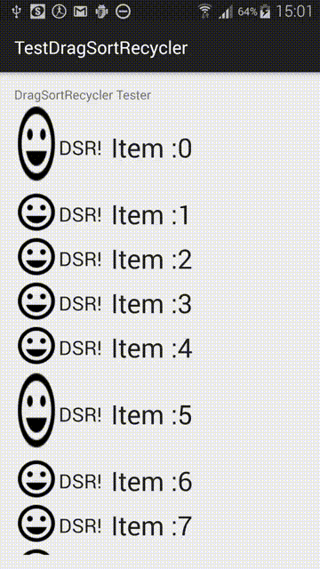

DragSortRecycler
================

DragDropRecycler allows you to easily add drag-and-drop functionaly to your existing RecyclerView.

The library consists of a single Java file which you connect to your RecyclerView - NO need to change or extend the RecyclerView itself, and NO need to extend your Adapter.



## Features
* Quick and easy to integrate
* Very smooth switching of items
* Select a view resource ID in the view to use as the 'handle'
* ..Or choose an area on the left of the list to use as the 'handle'
* Change auto scroll speed and distance from the top and bottom of list
* Choose the floating views alpha and background color
* Works with varying size of views

## Limitations
* Currently only work with vertical lists, horizontal lists later
* setHasStableIds must be set to true
* RecycleView ItemAnimator must be set to null

## Integration

In your adapter:
```java
 @Override
 public long getItemId(int position) {
   return position;
 }
```

Connecting to your RecyclerView
```java
        recyclerView = (RecyclerView) findViewById(R.id.recyclerView);
        recyclerView.setAdapter(adapter);
        recyclerView.setLayoutManager( new LinearLayoutManager(this));
        recyclerView.setItemAnimator(null);
        
        DragSortRecycler dragSortRecycler = new DragSortRecycler();
        dragSortRecycler.setViewHandleId(R.id.imageView); //View you wish to use as the handle
        

        dragSortRecycler.setItemMoveInterface(new DragSortRecycler.ItemMovedInterface() {
            @Override
            public void moveElement(int from, int to) {
                Log.d(TAG, "moveElements " + from + " to " + to);
            }
        });

        recyclerView.addItemDecoration(dragSortRecycler);
        recyclerView.addOnItemTouchListener(dragSortRecycler);
        recyclerView.setOnScrollListener(dragSortRecycler.getScrollListener());
```

Please note this is a first release, if I have done something wrong please let me know! Thank you.
